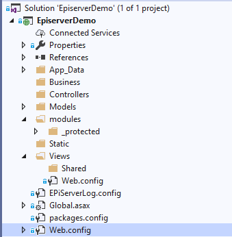
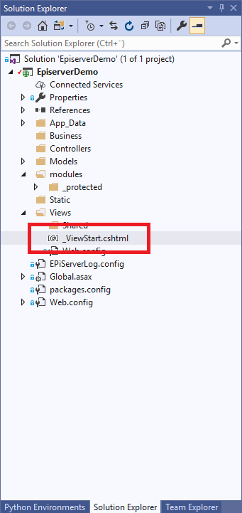
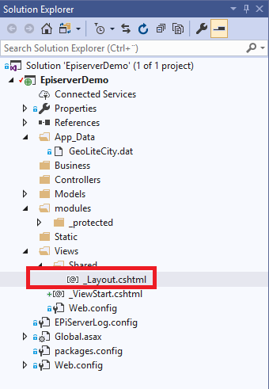

Setup layout file
=================

After creating a new Episerver project, you will have a folder structor that looks like this:

add a _ViewStart.cshtml file in the view folder

whit the following 

.. highlight:: CSharpLexer

@{
    Layout = "~/Views/Shared/_Layout.cshtml";
}

When a user want to see a page. 

Add a _layout.cshtml file in the shared folder

example of a basic layout file with boostrap::
