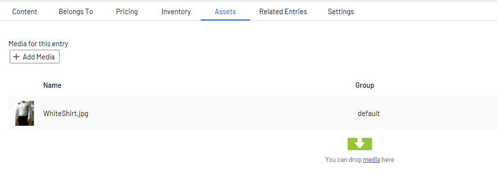

Assets
======
This capter is about getting images or other assets in episerver commerce

This assers are store on the NodeContent in the asses tap

Get url to a assets
-------------------

All commerce content are inheret NodeContent and NodeContent implement IAssetContainer.

The IAssetContainer contans a list of all assests on that NodeContent.

.. code-block:: csharp

 public class NodeContent : NodeContentBase, IMetaClass, ISearchEngineInformation, IChangeTrackable, ICategorizable, IAssetContainer

To help with getting a url to a assets you can use AssetUrlResolver

.. code-block:: csharp

 AssetUrlResolver.GetAssetUrl

The GetAssetUrl method gets the default asset for content. The collection of assets is ordered by SortOrder. The first item in the list is selected, which is in the specified default group for the content.

