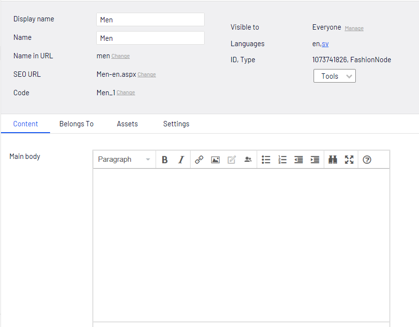
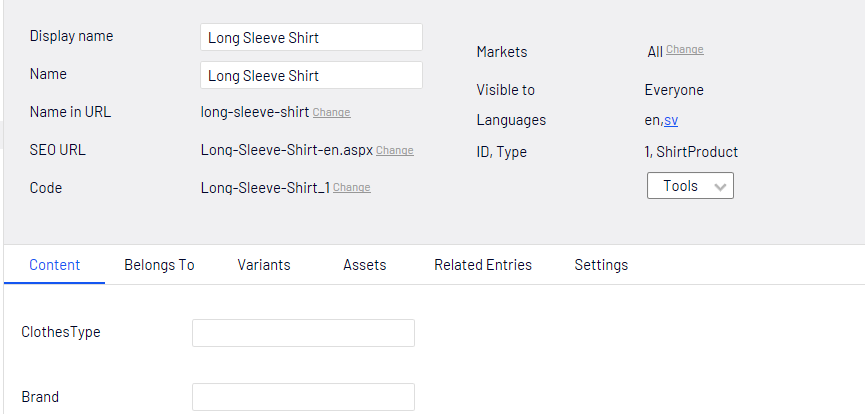
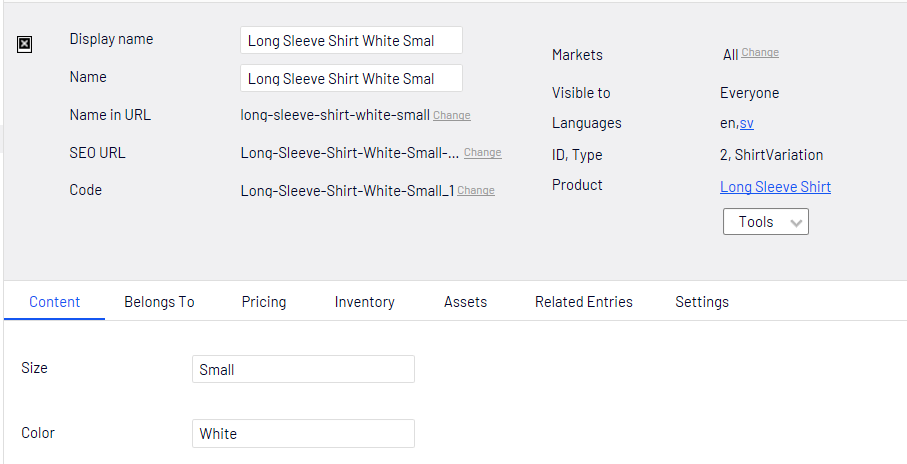
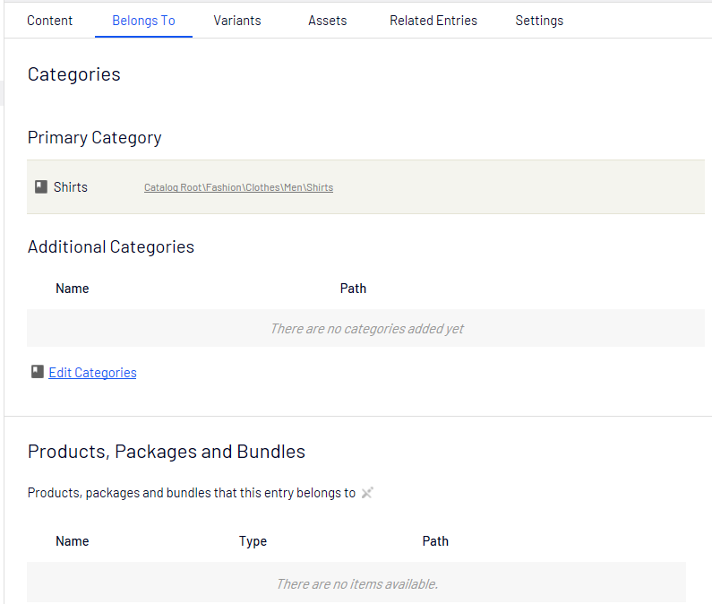
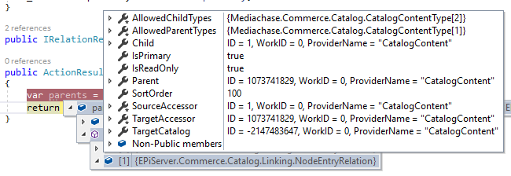

Content
=======

CatalogContentType
------------------

Episerver default page

.. image:: images/Catalog.png

NodeContent
-----------

ProductContent
--------------

VariationContent
----------------

Belongs To (NodeContent,ProductContent and VariationContent)
------------------------------------------------------------

Categories (Primary, other)

.. code-block:: csharp

 public ActionResult Index(ShirtProduct currentContent)
 {
    var parents = _relationRepository.GetParents<Relation>(currentContent.ContentLink);
    return View(currentContent);
 }

or using the extensions

.. code-block:: csharp

 public ActionResult Index(ShirtProduct currentContent)
 {
    var categories = currentContent.GetCategories();
    var bundles = currentContent.GetParentBundles();
    var bundles = currentContent.GetParentEntries();
    var products = currentContent.GetParentProducts();
    var related = currentContent.GetRelatedEntries();        
    return View(currentContent);
 }

Variants
--------

